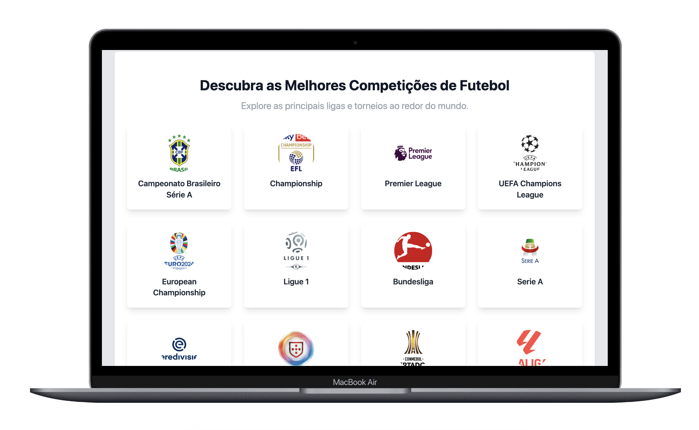
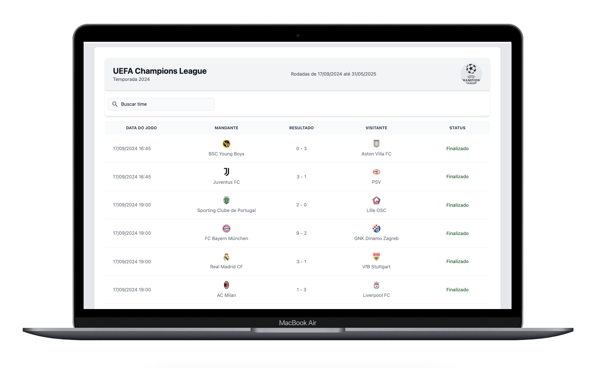
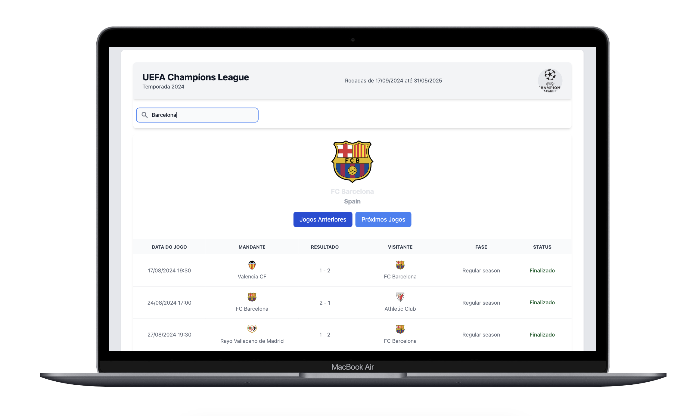

# Bet Soccer

Bet Soccer é um projeto desenvolvido em Laravel com Livewire que consome a API [Football Data](https://www.football-data.org/) para exibir informações sobre campeonatos, times e histórico de partidas.





## Funcionalidades

- Listagem de todas as competições disponíveis na API.
- Escolha de uma competição específica pelo usuário.
- Busca por um time dentro da competição escolhida.
- Exibição do histórico de jogos passados e futuros do time escolhido.



## Instalação

1. Clone o repositório:

   ```sh
   git clone https://github.com/rodrigodenner/betsoccer.git
   ```

2. Acesse a pasta do projeto:

   ```sh
   cd bet-soccer
   ```

3. Copie o arquivo `.env.example` para `.env` e configure as variáveis de ambiente:

   ```sh
   cp .env.example .env
   ```

  - Informe o token da API no arquivo `.env`:
    ```
    API_FOOTBALL_KEY=8c40c053a5aa4aebaa4835a18609cce7
    ```
    *(Caso não possua um token, use esse como exemplo.)*

4. Gere a chave da aplicação:

   ```sh
   php artisan key:generate
   ```

5. Execute as migrações do banco de dados:

   ```sh
   php artisan migrate
   ```

6. Instale as dependências do front-end:

   ```sh
   npm install
   ```

7. Inicie o Vite para compilar os assets:

   ```sh
   npm run dev
   ```

8. Inicie o servidor do Laravel:

   ```sh
   php artisan serve
   ```


